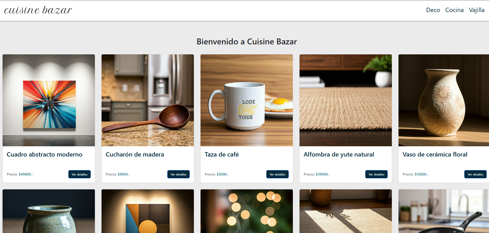

# Curso React CoderHouse - Proyecto Final

## Reseña del proyecto:

Creación de e-commerce en React con entorno Vite y React Router Dom para la navegación, conformado por un listado general de productos al inicio, secciones por categorías, detalles de producto, gestión de carrito y checkout con creación de órdenes. Utiliza Firestore como DB del catálogo de productos, permitiendo su consulta y modificación del stock, y también como almacenamiento de las órdenes creadas en el checkout y la obtención del Id de las mismas.

## Tecnologías utilizadas:

- React Router Dom v 6.27.0
- React Spinners v 0.14.1
- Firebase v 11.0.2
- Bootstrap v 5.3.3

## Características principales:

1. Código optimizado
2. Buenas prácticas
3. Implementación de React Router Dom para navegar el sitio
4. Implementación de Firestore Database para el almacenamiento 
5. Implementación de CSS y Bootstrap para darle estilos el sitio
6. Uso de Contexto en el carrito para gestionar su información


## Visita la web 💻

[Cuisine Bazar](https://cuisinebazar.netlify.app/)


### ScreenShot de la web 📸

**Home**



> 🔐 Usar el archivo .env.example como ejemplo para cargar los datos de configuración de tu propia Firebase

```
Comando para ejecutar servidor de prueba: npm run dev
```
