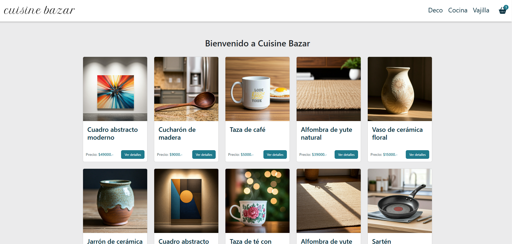

# Curso React CoderHouse - Proyecto Final

## Reseña del proyecto:

El proyecto de la cración de un e-commerce conformado por un listado general de productos, navegación por categorías, detalles de producto, agregado a carrito, administración de carrito y proceso de checkout

## Tecnologías utilizadas:

- React Router Dom v 6.27.0
- React Spinners v 0.14.1
- Firebase v 11.0.2
- Bootstrap v 5.3.3

## Características principales:

1. Código optimizado
2. Buenas practicas

## Visita la web 💻 

[Cuisine Bazar](https://federicoyantorno.dev/)

### ScreenShots de la web 📸 
**Logo**


**Home**



> 🔐 Usar el archivo .env.example como ejemplo para cargar los datos de configuración de Firebase

```
_Ejecutar servidor de prueba_
npm run dev
```
